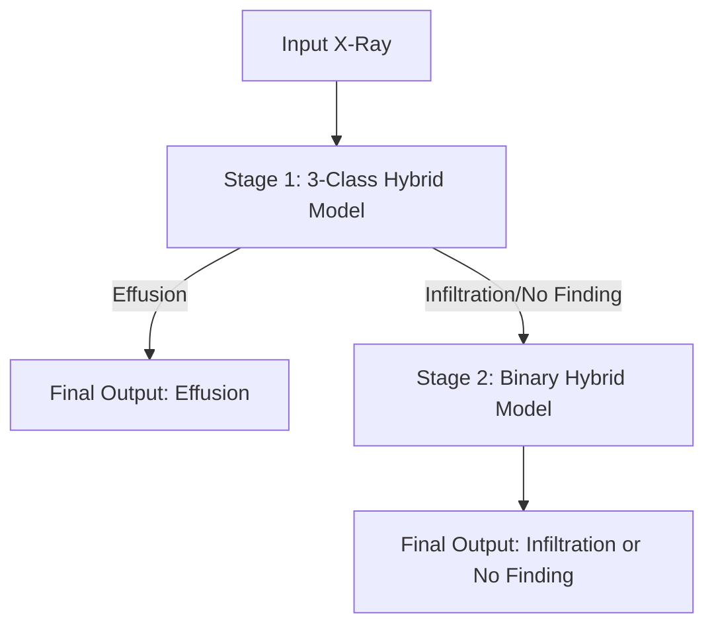

# 📘 Multi-Stage Hybrid CNN-ViT for Chest X-Ray Classification

This repository implements a deep learning pipeline to classify Chest X-Ray (CXR) images into **Effusion**, **Infiltration**, and **No Finding**.

The project uses a **Hybrid CNN-Transformer Architecture** (DenseNet121 + ViT) along with a **two-stage hierarchical inference strategy**, improving performance on visually similar thoracic conditions.

---

## 📂 Repository Contents

| File | Description |
|------|-------------|
| `Main.ipynb` | Full notebook: preprocessing, models, training (Stage 1 & 2), evaluation |
| `stage1_best_state.pth` | Trained weights for 3-class hybrid model |
| `stage2_best_state.pth` | Trained weights for binary (Infiltration vs No Finding) model |

---

## 🧠 Model Overview

### 🔷 Hybrid CNN-ViT Architecture

1. **DenseNet121 (CNN Backbone)** — Extracts strong local spatial features.  
2. **Projection Layer** — Converts CNN feature maps into transformer-ready embeddings.  
3. **Transformer Encoder (ViT)** — Captures global dependencies with self-attention.  
4. **MLP Head** — Outputs final class predictions.

---

## 🔁 Hierarchical Inference Strategy



**Why this works:**  
- Effusion is visually distinct → Stage 1 handles it well.  
- Infiltration vs No Finding are subtle → Stage 2 specializes just on these two.

---

## 📊 Dataset

Dataset images are **not included** due to size limits.

Training data was taken from the **NIH ChestX-ray14 dataset**:

- **Classes used:** Effusion, Infiltration, No Finding  
- **Balanced sampling:** 3,955 images per class  
- **Total used:** ~11,865 X-rays  

This balanced subset helps prevent class bias and improves generalization.

---

## 🚀 Getting Started

### Prerequisites
- Python 3.8+
- Git LFS (required for downloading `.pth` model weights)

### Installation

```bash
git lfs install
git clone https://github.com/HarshChand-29/Multi-class-chest-xray-classification.git
cd Multi-class-chest-xray-classification
```

Install dependencies:

```bash
pip install torch torchvision opencv-python pandas numpy scikit-learn matplotlib seaborn tqdm transformers
```

---

## ▶️ Usage

### 1. **Run Inference**
Use `hierarchical_predict()` inside `Main.ipynb` to classify new images using both Stage 1 and Stage 2 models.

### 2. **Retrain the Models**
If training from scratch:

1. Download NIH dataset  
2. Filter for the 3 selected classes  
3. Sample 3,955 images per class  
4. Update paths in `Main.ipynb`  
5. Run training cells  

---

## 🛠️ Preprocessing & Augmentation

- **CLAHE** for contrast enhancement  
- Resize → **224 × 224**  
- Augmentations:
  - Random Resized Crop  
  - Horizontal Flip  
  - Random Rotation (±10°)

---

## 📚 Citation

If you use the NIH ChestX-ray dataset, cite:

> Wang X, Peng Y, Lu L, Lu Z, Bagheri M, Summers RM. *ChestX-ray8: Hospital-scale Chest X-ray Database and Benchmarks on Weakly-Supervised Classification and Localization of Common Thorax Diseases.* IEEE CVPR 2017.

---

## 🤝 Contributor

**Harsh** — Lead Developer

---

## 📄 License

Open-source under the **MIT License**.
